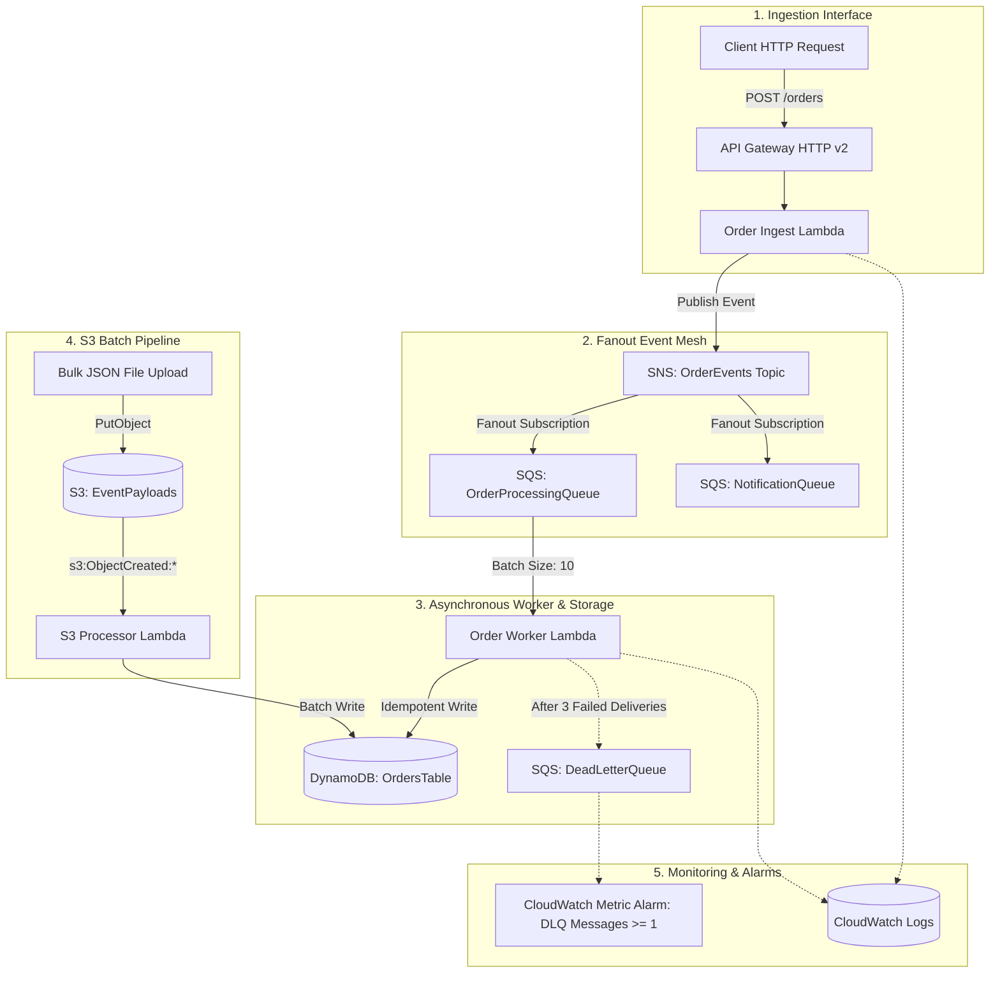

# Architecture Deep Dive: Event-Mesh Cloud Platform

This document provides a comprehensive technical overview of the design patterns, failure modes, idempotency mechanisms, and local cloud simulation strategies used in the **Event-Mesh Cloud Platform**.

---

## 🏛️ Architectural Topology



---

## 🔑 Core Design Principles

### 1. Decoupled Ingestion & Fanout Pattern
- HTTP clients ingest orders via **Amazon API Gateway v2 (HTTP API)**.
- The `order_ingest` Lambda validates payload integrity with **Pydantic** models, assigns a unique `order_id` and `trace_id`, and immediately publishes the event to an **Amazon SNS** topic.
- SNS fans out the message to multiple downstream **Amazon SQS** queues without tight coupling between producers and consumers.

### 2. Idempotency & Duplicate Protection
In distributed cloud architectures, messaging systems provide *at-least-once* delivery. To prevent duplicate billing or multiple order executions:
- `order_worker` uses DynamoDB conditional writes:
  ```python
  table.put_item(
      Item=item,
      ConditionExpression="attribute_not_exists(order_id)",
  )
  ```
- If a duplicate message arrives, the `ConditionalCheckFailedException` is caught gracefully, logged with the `trace_id`, and acknowledged to prevent infinite re-deliveries.

### 3. Partial Batch Failure Handling (`ReportBatchItemFailures`)
Rather than failing an entire batch of 10 SQS records when a single record encounters an unhandled error:
- The Lambda event source mapping uses `function_response_types = ["ReportBatchItemFailures"]`.
- The handler returns:
  ```json
  {
    "batchItemFailures": [
      {"itemIdentifier": "failed-message-id"}
    ]
  }
  ```
- SQS only retries the specific failed message while acknowledging the 9 successful ones.

### 4. Dead-Letter Queue (DLQ) & Redrive Strategy
- If a poisoned message fails processing across **3 delivery attempts**, SQS automatically redirects it to the **Dead-Letter Queue (`event-mesh-order-events-dlq`)**.
- A **CloudWatch Metric Alarm** monitors `ApproximateNumberOfMessagesVisible >= 1` on the DLQ and alerts on operational drift.

### 5. Zero-Cost Local Cloud Simulation (LocalStack)
- All Terraform modules, SNS-to-SQS fanout subscriptions, S3 event notifications, and Lambda triggers run locally against **LocalStack v3** without needing AWS cloud accounts or incurring cloud spend.
- Automated GitHub Actions spin up ephemeral LocalStack service containers, apply Terraform, and execute end-to-end integration tests on every pull request.
