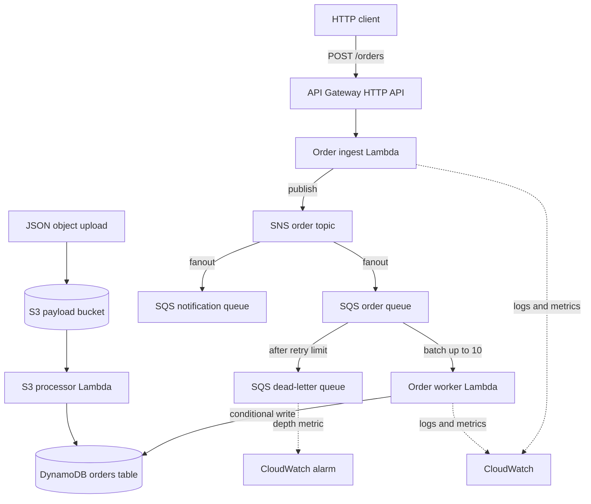

# Architecture

This document describes the event-processing reference implemented by the repository, including its delivery semantics, failure paths, and current boundaries.

## System topology



## HTTP ingestion and fanout

API Gateway invokes `order_ingest` for `POST /orders`. The handler validates the payload with Pydantic, assigns an `order_id` and `trace_id`, and publishes an event to SNS. It returns after SNS accepts the publish request rather than waiting for downstream processing.

SNS subscriptions deliver independent copies to the order-processing and notification queues. This avoids a direct dependency between the producer and each consumer, and it allows consumers to progress at different rates. It also makes propagation asynchronous: an accepted HTTP response means the event was published, not that every downstream action is complete.

The notification queue currently has no consumer. It represents an extension point rather than a finished notification capability.

## Delivery semantics and idempotency

SQS uses at-least-once delivery, so duplicate messages are part of normal operation. `order_worker` protects the DynamoDB insert with:

```python
table.put_item(
    Item=item,
    ConditionExpression="attribute_not_exists(order_id)",
)
```

A duplicate `order_id` raises `ConditionalCheckFailedException`; the handler records the duplicate and acknowledges it. This prevents duplicate rows for that key. Other side effects would require their own idempotency keys or transaction boundaries.

## Partial batch failures

The SQS event source mapping enables `ReportBatchItemFailures`. When one record fails, the handler returns only that message identifier:

```json
{
  "batchItemFailures": [
    {"itemIdentifier": "failed-message-id"}
  ]
}
```

Successful records in the same invocation are acknowledged. Failed records are retried after the visibility timeout. A message that reaches the configured maximum receive count is moved to the DLQ.

The DLQ prevents a persistent poison message from blocking unrelated records, but it does not resolve the underlying data problem. Production operation needs ownership, alert routing, retention, and a reviewed replay or disposal procedure.

## S3 batch path

The versioned, encrypted S3 bucket accepts JSON payload files and invokes `s3_processor` on object creation. The processor writes parsed orders into the same DynamoDB table. This path models bulk or partner ingestion separately from the HTTP path.

S3 events can also be duplicated or arrive out of order. Batch input therefore follows the same idempotency requirement as queued events.

## Traceability and monitoring

The ingestion path propagates a trace identifier through HTTP headers, SNS message attributes, and structured logs. This supports correlation across asynchronous boundaries without implying full distributed tracing. CloudWatch log groups retain service output, and a queue-depth alarm detects visible DLQ messages.

An operational deployment would normally add service-level objectives, dashboards, paging routes, log retention policy, and tracing infrastructure appropriate to its support model.

## Local and AWS environments

The local Terraform composition points supported AWS APIs to LocalStack and is used by integration, failure-injection, and benchmark tests. The AWS composition uses remote state and a GitHub OIDC role for deployments.

Local integration verifies resource wiring and application behavior, but it cannot validate all IAM interactions, quotas, latency, concurrency scaling, or regional service behavior. Changes intended for AWS should be reviewed through a saved Terraform plan and verified in a controlled AWS environment.

## Design boundaries

This proof of concept concentrates on the order event path. It does not include client authentication and authorization, payment or inventory transactions, a notification implementation, schema registry and compatibility enforcement, multi-region recovery, or an automated DLQ replay service. Those concerns should be added only with explicit ownership and failure semantics.
