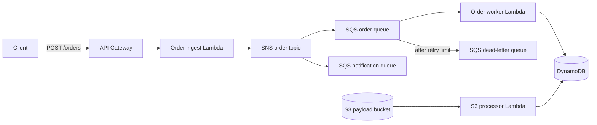

# Event-Mesh Cloud Platform

[](https://github.com/AAAmer91/event-mesh-cloud-platform/actions/workflows/ci.yml)
[](https://github.com/AAAmer91/event-mesh-cloud-platform/actions/workflows/lint-and-security.yml)
[](https://github.com/AAAmer91/event-mesh-cloud-platform/actions/workflows/scheduled-benchmark.yml)
[](LICENSE)

Event-Mesh Cloud Platform is a proof of concept for an asynchronous order-processing service on AWS. It isolates order intake from downstream processing through SNS and SQS, applies idempotent writes in DynamoDB, and defines the infrastructure with reusable Terraform modules.

The repository represents a working slice of a larger event-driven system. LocalStack provides a repeatable development and integration environment; the AWS configuration models promotion through short-lived identity and protected environments. Production adoption would still require organization-specific networking, identity, data governance, alert routing, capacity planning, and disaster-recovery decisions.

## Start here

Read the [beginner guide](docs/BEGINNER_GUIDE.md) for a plain-language explanation of events, queues, retries, and the role of LocalStack.

One order follows this path:

1. API Gateway invokes the ingestion Lambda for `POST /orders`.
2. The Lambda validates the request and publishes an event to SNS.
3. SNS copies the event to independent SQS queues.
4. The order worker consumes its queue and conditionally writes the order to DynamoDB.
5. Repeatedly failing messages move to a dead-letter queue for investigation.

## Architecture



See [Architecture](ARCHITECTURE.md) for delivery semantics, failure handling, and design boundaries.

## Current scope

| Area | Implementation |
| --- | --- |
| Application | Python Lambda handlers for HTTP ingestion, queued processing, and S3 batch ingestion |
| Messaging | SNS fanout, SQS consumers, partial batch failure responses, and DLQ redrive |
| Persistence | DynamoDB conditional writes and query indexes; versioned, encrypted S3 payload storage |
| Infrastructure | Terraform modules with LocalStack and AWS environment compositions |
| Observability | Structured logs, trace correlation, custom metrics, and a DLQ depth alarm |
| Verification | Unit, integration, failure-injection, and performance tests |
| Delivery | GitHub Actions quality gates, immutable artifacts, OIDC deployment, protected promotion, and rollback |
| Supply chain | Dependency checks, CodeQL, SBOM generation, and provenance attestations |

Conditional writes prevent a second record with the same `order_id`; they do not turn the entire distributed workflow into exactly-once delivery. Consumers must still be designed for at-least-once messaging.

## Repository layout

```text
src/                             Lambda handlers and shared runtime code
tests/unit/                      Fast isolated behavior tests
tests/integration/               LocalStack infrastructure and message-flow tests
infra/terraform/modules/         Reusable compute, messaging, storage, and observability modules
infra/terraform/environments/    Local and AWS compositions
infra/terraform/bootstrap/       GitHub OIDC role and Terraform state bootstrap
scripts/                         Packaging, benchmark, failure-injection, and reporting tools
.github/workflows/                Verification, release, deployment, and scheduled checks
docs/                            Explanatory and operational documentation
```

## Local development

Prerequisites:

- Docker with Compose v2
- Python 3.11 or later
- Terraform 1.5 or later
- GNU Make

Create the local infrastructure:

```bash
make up
make package
make tf-init
make tf-apply
```

Run the main verification paths:

```bash
make test-unit
make test-integration
make lint
```

Optional failure and load exercises:

```bash
make chaos
make bench
```

LocalStack emulates the AWS APIs used by this project. Results are useful for development and integration testing but do not establish AWS service quotas, latency, IAM boundaries, or regional failure behavior.

## Documentation

- [Beginner guide](docs/BEGINNER_GUIDE.md) — system concepts and a suggested learning path
- [Architecture](ARCHITECTURE.md) — event flow, delivery semantics, and failure handling
- [CI/CD operations](docs/CICD.md) — repository settings, release, deployment, and rollback
- [Contributing](CONTRIBUTING.md) — development and pull-request expectations
- [Security policy](SECURITY.md) — supported scope and private reporting

Each Terraform module also contains a README describing its responsibility, inputs, and outputs.

## License

This project is licensed under the [MIT License](LICENSE).
