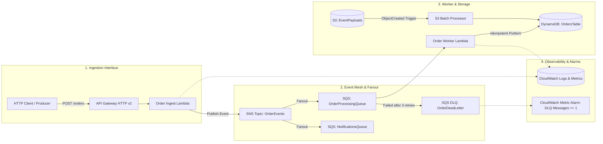
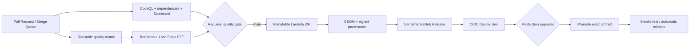

# ⚡ Event-Mesh Cloud Platform

[](https://github.com/AAAmer91/event-mesh-cloud-platform/actions/workflows/ci.yml)
[](https://github.com/AAAmer91/event-mesh-cloud-platform/actions/workflows/lint-and-security.yml)
[](https://github.com/AAAmer91/event-mesh-cloud-platform/actions/workflows/scheduled-benchmark.yml)
[](https://www.terraform.io/)
[](https://aws.amazon.com/)
[](https://www.localstack.cloud/)
[](https://www.python.org/)
[](LICENSE)


> A production-ready, event-driven AWS platform reference architecture built with **Terraform**, **Python Lambda handlers**, **SNS/SQS event fanout**, **DynamoDB idempotency**, and **LocalStack** running through a secure GitHub Actions CI/CD supply chain.

---

## 🏛️ System Architecture



---

## 🌟 Key Features

* **⚡ Resilient Fanout Messaging:** Uses Amazon SNS $\to$ Amazon SQS subscriptions to decouple order intake from downstream fulfillment and notification services.
* **🛡️ Idempotent Execution:** Guarantees zero duplicate order writes in DynamoDB via conditional write expressions (`attribute_not_exists(order_id)`).
* **🔄 Partial Batch Failure Isolation:** Configured with `ReportBatchItemFailures` so failed queue items are isolated and redriven without stalling the batch.
* **📦 Dead Letter Queue (DLQ) & Alerting:** Automatic message quarantine after 3 failed delivery attempts paired with CloudWatch depth alarms.
* **🧪 Chaos & Resilience Simulation:** Built-in chaos testing tool (`make chaos`) validating zero data loss under concurrent burst traffic and poisoned message injections.
* **⏱️ High-Precision Performance Benchmarking:** Calculates $p50, p90, p95, p99$ latency percentiles and exports structured JSON telemetry.
* **🔬 Distributed Trace Correlation:** End-to-end trace context propagation across HTTP headers, SNS MessageAttributes, and CloudWatch structured JSON logs.
* **🔒 DevSecOps Quality Gate:** AST static security vulnerability scanning (Bandit), strict PEP 484 static typing (Mypy), and Ruff linting.
* **🧪 100% Local Cloud Simulation:** Fully provisioned and tested locally against **LocalStack v3** via Docker Compose—zero cloud bills.
* **🚀 Evidence-Driven CI/CD:** Reusable workflows, required aggregate gates, immutable artifacts, OIDC deployment, protected environment promotion, rollback, SBOM/provenance attestations, and evidence-based PR reports.
* **📈 Persistent Delivery Telemetry:** Scheduled benchmarks compare historical baselines, publish a GitHub Pages dashboard, and automatically open or resolve regression incidents.

---

## 🔁 CI/CD Delivery Path



The pipeline builds the deployment artifact once and promotes the exact same digest. AWS access uses short-lived GitHub OIDC tokens; no long-lived AWS keys are stored. See [CI/CD and deployment operations](docs/CICD.md) for the security model, repository settings, environment setup, rollback procedure, and evidence catalog.

---

## 📂 Repository Structure

```text
event-mesh-cloud-platform/
├── .github/
│   ├── workflows/
│   │   ├── ci.yml                  # Orchestrated CI/CD and protected promotion graph
│   │   ├── reusable-quality.yml    # Test matrix, quality, artifact, SBOM, Terraform validation
│   │   ├── reusable-integration.yml# Reusable LocalStack E2E verification
│   │   ├── lint-and-security.yml   # CodeQL, dependency audit/review, OpenSSF Scorecard
│   │   ├── scheduled-benchmark.yml # Regression incidents and GitHub Pages evidence
│   │   ├── release.yml             # Semantic release and artifact attestations
│   │   └── deploy.yml              # OIDC environments, plans, smoke tests, rollback
│   ├── actions/setup-localstack/   # Repository-local composite action
│   ├── dependabot.yml              # Python, Actions, Terraform, and Docker updates
│   ├── CODEOWNERS
│   ├── ISSUE_TEMPLATE/            # Enterprise GitHub Bug & Feature form templates
│   └── pull_request_template.md
├── infra/
│   └── terraform/
│       ├── environments/
│       │   ├── local/             # LocalStack provider (http://localhost:4566)
│       │   │   ├── main.tf
│       │   │   ├── outputs.tf
│       │   │   └── variables.tf
│       │   └── prod/               # Remote-state AWS dev/production environment
│       ├── bootstrap/              # OIDC provider, deploy role, protected state bucket
│       └── modules/
│           ├── compute/           # Lambda functions & API Gateway v2 [README.md]
│           ├── messaging/         # SNS topics, SQS queues, DLQ & redrive policies [README.md]
│           ├── storage/           # S3 bucket with notifications & DynamoDB table [README.md]
│           └── observability/     # CloudWatch log groups & DLQ metric alarms [README.md]
├── scripts/
│   ├── benchmark_events.py        # High-throughput load benchmarking & latency percentiles
│   ├── chaos_test.py              # Chaos & poison-pill resilience simulation tool
│   ├── generate_summary.py         # Fail-closed GitHub Actions summary
│   ├── validate_results.py         # SLA and historical regression quality gate
│   ├── render_performance_site.py  # Persistent GitHub Pages evidence dashboard
│   ├── release_version.py          # Conventional semantic release calculation
│   └── build_lambda.py             # Deterministic dependency-complete Lambda ZIP
├── src/
│   ├── core/
│   │   ├── logger.py              # Structured JSON logging
│   │   ├── metrics.py             # Custom CloudWatch metric emitter
│   │   └── tracing.py             # Distributed trace context & SNS propagator
│   └── handlers/
│       ├── order_ingest.py        # Ingestion API endpoint -> SNS publisher
│       ├── order_worker.py        # SQS consumer with idempotent DynamoDB write & retry logic
│       └── s3_processor.py        # S3 batch file event parser
├── tests/
│   ├── conftest.py                # LocalStack fixtures & boto3 AWS clients
│   ├── integration/
│   │   ├── test_end_to_end_flow.py# Full pipeline test: API -> SNS -> SQS -> DynamoDB
│   │   ├── test_dlq_resilience.py # Simulates malformed payload -> verifies DLQ routing
│   │   └── test_s3_ingestion.py   # Simulates S3 upload -> verifies worker aggregation
│   └── unit/
│       └── test_handlers.py       # Unit tests with mocked AWS SDK calls
├── docker-compose.yml             # LocalStack v3 with auto-provisioning
├── Makefile                       # Single-command dev workflow (`make up`, `make chaos`, `make bench`)
├── pyproject.toml                 # Ruff, Pytest, MyPy configurations
├── requirements.txt / requirements.lock / dev-requirements.txt
├── ARCHITECTURE.md                # Deep-dive architecture and design decisions
├── CONTRIBUTING.md                # Open-source contribution guide
├── SECURITY.md                    # Vulnerability reporting protocols
└── README.md
```

---

## 🚀 Quick Start (Local Setup)

### 1. Prerequisites
- [Docker & Docker Compose](https://www.docker.com/)
- [Python 3.11+](https://www.python.org/)
- [Terraform 1.5+](https://www.terraform.io/)

### 2. Start LocalStack & Provision Infrastructure
```bash
# Spin up LocalStack v3 in background and apply Terraform
make up
make package
make tf-init
make tf-apply
```

### 3. Run Automated Tests
```bash
make test-unit        # Fast in-memory unit tests
make test-integration # End-to-end LocalStack integration tests
make test             # Full suite with coverage report
```

### 4. Run Chaos & Benchmark Simulations
```bash
make chaos            # Injects burst traffic + poison-pill messages (verifies DLQ routing)
make bench            # Runs concurrent ingestion load benchmark
```

---

## 🧪 Testing & Verification Strategy

| Test Layer | Framework | Description |
|---|---|---|
| **Unit Tests** | `pytest`, `moto` | Fast in-memory tests validating Pydantic schemas, payload error responses, and idempotency logic. |
| **Integration Tests** | `pytest`, `LocalStack` | Tests real asynchronous SNS fanout, SQS queue consumption, DLQ redrive, S3 bucket notifications, and DynamoDB storage. |
| **Chaos Simulation** | `python`, `boto3` | Injects 100 concurrent orders with 10% deliberate failure payloads to verify zero data loss and automated DLQ quarantine. |
| **Lint & Types** | `ruff`, `mypy`, `terraform` | Formatting, lint, typing, coverage threshold, IaC format and validation. |
| **Supply Chain** | CodeQL, dependency review, pip-audit, OpenSSF Scorecard | SAST, vulnerable dependency blocking, workflow hardening, SBOM and signed provenance. |
| **Delivery** | GitHub Environments, AWS OIDC | Reviewed plans, immutable promotion, post-deployment smoke test, automatic rollback. |

---

## 📄 License
This project is licensed under the [MIT License](LICENSE).
