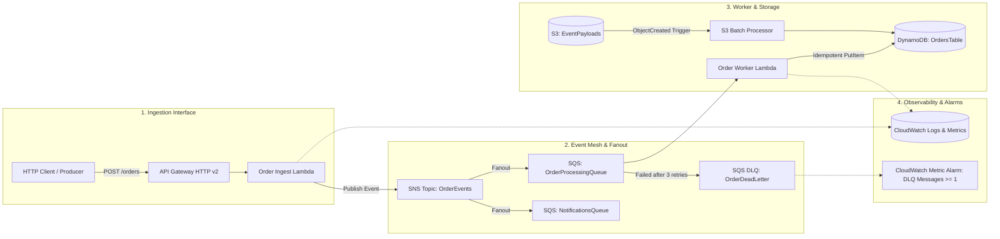

# ⚡ Event-Mesh Cloud Platform

[](https://github.com/AAAmer91/event-mesh-cloud-platform/actions/workflows/ci.yml)
[](https://github.com/AAAmer91/event-mesh-cloud-platform/actions/workflows/lint-and-security.yml)
[](https://www.terraform.io/)
[](https://aws.amazon.com/)
[](https://www.localstack.cloud/)
[](https://www.python.org/)
[](LICENSE)

> A production-ready, event-driven AWS platform reference architecture built with **Terraform**, **Python/FastAPI serverless handlers**, **SNS/SQS event fanout**, **DynamoDB idempotency**, and **LocalStack testcontainers** running in automated GitHub Actions CI pipelines.

---

## 🏛️ System Architecture



---

## 🌟 Key Features

* **⚡ Resilient Fanout Messaging:** Uses Amazon SNS $\to$ Amazon SQS subscriptions to decouple order intake from downstream fulfillment and notification services.
* **🛡️ Idempotent Execution:** Guarantees zero duplicate order writes in DynamoDB via conditional write expressions (`attribute_not_exists(order_id)`).
* **🔄 Partial Batch Failure Isolation:** Configured with `ReportBatchItemFailures` so failed queue items are isolated and redriven without stalling the batch.
* **📦 Dead Letter Queue (DLQ) & Alerting:** Automatic message quarantine after 3 failed delivery attempts paired with CloudWatch depth alarms.
* **🧪 100% Local Cloud Simulation:** Fully provisioned and tested locally against **LocalStack v3** via Docker Compose—zero cloud bills.
* **🚀 Production-Grade CI/CD:** Complete GitHub Actions pipeline executing unit tests in matrix across Python 3.11/3.12 and end-to-end Terraform + LocalStack integration suites on every PR.

---

## 📂 Repository Structure

```text
event-mesh-cloud-platform/
├── .github/
│   ├── workflows/
│   │   ├── ci.yml                 # LocalStack service container + Terraform apply + Pytest integration suite
│   │   ├── lint-and-security.yml  # TFLint, Terraform fmt, Ruff linter
│   │   └── release.yml            # Semantic release and GitHub release tagging
│   └── pull_request_template.md
├── infra/
│   └── terraform/
│       ├── environments/
│       │   ├── local/             # LocalStack provider (http://localhost:4566)
│       │   │   ├── main.tf
│       │   │   ├── outputs.tf
│       │   │   └── variables.tf
│       │   └── prod/              # Production AWS provider
│       └── modules/
│           ├── compute/           # Lambda functions & API Gateway v2
│           ├── messaging/         # SNS topics, SQS queues, DLQ & redrive policies
│           ├── storage/           # S3 bucket with notifications & DynamoDB table
│           └── observability/     # CloudWatch log groups & DLQ metric alarms
├── src/
│   ├── core/
│   │   ├── logger.py              # Structured JSON logging with trace correlation
│   │   └── metrics.py             # Custom CloudWatch metric emitter
│   └── handlers/
│       ├── order_ingest.py        # Ingestion API endpoint -> SNS publisher
│       ├── order_worker.py        # SQS consumer with idempotent DynamoDB write & retry logic
│       └── s3_processor.py        # S3 batch file event parser
├── tests/
│   ├── conftest.py                # LocalStack fixtures & boto3 AWS clients
│   ├── integration/
│   │   ├── test_end_to_end_flow.py# Full pipeline test: API -> SNS -> SQS -> DynamoDB
│   │   ├── test_dlq_resilience.py # Simulates malformed payload -> verifies DLQ routing
│   │   └── test_s3_ingestion.py   # Simulates S3 upload -> verifies worker aggregation
│   └── unit/
│       └── test_handlers.py       # Unit tests with mocked AWS SDK calls
├── docker-compose.yml             # LocalStack v3 with auto-provisioning
├── Makefile                       # Single-command dev workflow
├── pyproject.toml                 # Ruff, Pytest, MyPy configurations
├── requirements.txt / dev-requirements.txt
├── ARCHITECTURE.md                # Deep-dive architecture and design decisions
└── README.md
```

---

## 🚀 Quick Start (Local Setup)

### 1. Prerequisites
- [Docker & Docker Compose](https://www.docker.com/)
- [Python 3.11+](https://www.python.org/)
- [Terraform 1.5+](https://www.terraform.io/)

### 2. Start LocalStack
```bash
# Spin up LocalStack v3 in background
docker compose up -d
```

### 3. Provision Infrastructure with Terraform
```bash
# Initialize and apply Terraform against LocalStack
cd infra/terraform/environments/local
terraform init
terraform apply -auto-approve
```

### 4. Run Test Suite
```bash
# In the project root:
pytest tests/unit -v              # Fast in-memory unit tests
pytest tests/integration -v       # End-to-end LocalStack integration tests
```

---

## 🧪 Testing & Verification Strategy

| Test Layer | Framework | Description |
|---|---|---|
| **Unit Tests** | `pytest`, `moto` | Fast in-memory tests validating Pydantic schemas, payload error responses, and idempotency logic. |
| **Integration Tests** | `pytest`, `LocalStack` | Tests real asynchronous SNS fanout, SQS queue consumption, DLQ redrive, S3 bucket notifications, and DynamoDB storage. |
| **Lint & Security** | `ruff`, `terraform fmt` | Strict code quality, formatting, and infrastructure syntax validation. |

---

## 📄 License
This project is licensed under the [MIT License](LICENSE).
