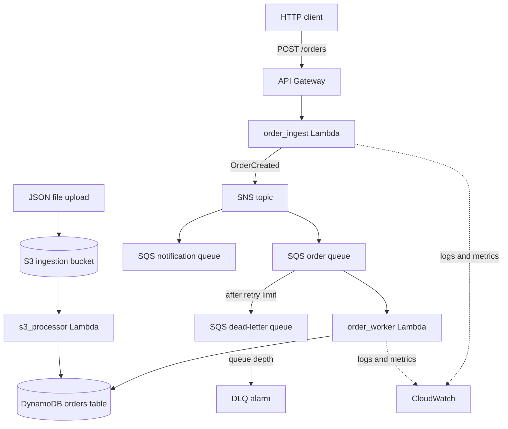

# Beginner Guide

This guide explains the complete project without assuming previous AWS, serverless, Terraform, or event-driven architecture experience. It follows an order through the system, explains why each AWS service exists, and connects the application, infrastructure, tests, and delivery workflows.

## 1. What problem does this project solve?

An order request may eventually need persistence, notifications, analytics, inventory work, or other downstream actions. If the HTTP endpoint calls every downstream system directly, the response becomes as slow and fragile as the entire chain.

This proof of concept separates order intake from order processing:

1. the API validates and accepts an order;
2. an event records that the order was created;
3. independent queues hold work for different consumers;
4. a worker processes the order and stores it;
5. repeated failures are isolated for investigation.

The repository is a working slice of a larger event-processing platform. It focuses on delivery semantics, infrastructure composition, operational evidence, and safe deployment rather than implementing a complete commerce system.

## 2. The system in one picture



The main components are:

| Component | Responsibility | Why it is separate |
| --- | --- | --- |
| API Gateway | Provide the public `POST /orders` route in AWS | Keeps HTTP routing outside the Lambda code |
| `order_ingest` Lambda | Validate input, calculate totals, add IDs, and publish an event | Keeps client-facing work short |
| SNS topic | Fan one event out to multiple subscribers | Producers do not need to know every consumer |
| Order SQS queue | Durably buffer order-processing work | Worker speed and availability are decoupled from ingestion |
| Notification SQS queue | Receive an independent copy of each event | Represents an extension point for a future consumer |
| `order_worker` Lambda | Consume queued events and write processed orders | Scales from queue activity rather than HTTP traffic |
| DynamoDB | Store processed orders | Provides managed persistence and conditional writes |
| Dead-letter queue | Isolate messages that exceed their retry allowance | Poison messages do not block healthy work |
| S3 and `s3_processor` | Support JSON file-based batch ingestion | Models a second ingestion path |
| CloudWatch | Store logs, custom metrics, and the DLQ alarm | Provides basic operational signals |
| Terraform | Create and connect the cloud resources | Makes infrastructure reviewable and repeatable |

## 3. Follow one order from HTTP to DynamoDB

### Step 1: the client submits an order

In AWS, API Gateway invokes `order_ingest` for `POST /orders`. A representative request is:

```json
{
  "customer_id": "cust-1042",
  "items": [
    {
      "item_id": "sku-7",
      "name": "USB-C adapter",
      "quantity": 2,
      "unit_price": 14.5
    }
  ],
  "currency": "USD"
}
```

Pydantic validates that the order has a customer, at least one item, positive quantities, and positive prices. Malformed JSON returns HTTP 400; schema validation errors return HTTP 422.

The handler generates an `order_id` when one was not supplied, generates a `trace_id`, calculates the total, sets the initial status to `PENDING`, and records a UTC creation time.

### Step 2: ingestion publishes `OrderCreated`

The handler publishes the order event to SNS with event type, customer, and trace metadata. If SNS accepts the publish, the API returns HTTP 201 with the order ID and trace ID.

An HTTP 201 means the event was accepted for processing. It does not mean the worker has already written the order to DynamoDB or that every subscriber has completed its work. That delay is called eventual consistency.

If publishing fails, the handler returns HTTP 502 rather than reporting an order that cannot enter the processing path.

### Step 3: SNS fans out the event

SNS sends an independent copy to:

- the order-processing queue;
- the notification queue.

This is fanout. Adding a new subscriber does not require changing `order_ingest`, as long as the new consumer understands the event contract.

The notification queue intentionally has no consumer. It demonstrates the extension point but does not claim that notifications are implemented.

### Step 4: SQS invokes the worker

The Lambda event source mapping reads up to 10 order messages, with a batching window of up to five seconds, and invokes `order_worker`. The worker unwraps the SNS envelope, converts numeric values for DynamoDB, and attempts to persist each order.

The primary queue uses long polling, a visibility timeout, four-day retention, and a redrive policy. While a message is being processed, the visibility timeout temporarily hides it from other workers. If processing does not complete successfully, the message becomes visible for another attempt.

### Step 5: the worker performs an idempotent write

The worker stores the order with status `PROCESSED` using this condition:

```python
ConditionExpression="attribute_not_exists(order_id)"
```

If the same `order_id` is delivered again, DynamoDB rejects the second insert and the worker treats it as an already-processed duplicate. The table therefore contains one item for that order key.

This protects the DynamoDB insert only. If a future worker also charges a card, reserves inventory, or sends email, each side effect needs its own idempotency key or transaction design.

## 4. Why duplicate delivery is normal

SQS provides at-least-once delivery. Consider this sequence:

1. the worker writes an order successfully;
2. the worker stops before AWS records successful message completion;
3. the visibility timeout expires;
4. SQS delivers the message again.

This is not necessarily an SQS defect. Distributed systems cannot always determine whether work completed before a connection or process failed. Consumers must therefore tolerate duplicates.

The project does not claim exactly-once processing. It demonstrates one practical protection: a conditional database write keyed by `order_id`.

## 5. How partial batch failure works

One Lambda invocation can receive multiple SQS records. If one record is bad, retrying the entire batch would repeat every successful record.

The event source mapping enables `ReportBatchItemFailures`. The handler returns only the failed message identifiers:

```json
{
  "batchItemFailures": [
    {"itemIdentifier": "failed-message-id"}
  ]
}
```

SQS removes successful records and retries only the reported failures. The `simulate_error` request field deliberately creates a worker failure for resilience tests; it is an evaluation mechanism, not a production API feature.

After the configured maximum of three receives, a persistent failure moves to the order DLQ. DLQ messages are retained for fourteen days by default, and a CloudWatch alarm enters alarm state when at least one message is visible.

A DLQ is not automatic recovery. Operators still need to answer:

- Why did the message fail?
- Is the input invalid or is the consumer defective?
- Is replay safe and idempotent?
- Should the message be corrected, replayed, or discarded?
- Who owns response before retention expires?

## 6. The S3 batch-ingestion path

The S3 path models orders arriving as JSON files rather than HTTP requests:

1. a JSON object is written to the ingestion bucket;
2. an object-created notification invokes `s3_processor`;
3. the processor reads the file and writes its orders to the same DynamoDB table.

The bucket enables versioning and Amazon S3-managed AES-256 encryption. The S3 processor records the source file with each item, improving traceability.

S3 notifications can also be duplicated or arrive out of order. This path has the same need for idempotency as the SQS path. A production implementation would additionally define input schema versioning, file-size limits, lifecycle rules, quarantine behavior, and replay ownership.

## 7. What “serverless” means here

Serverless does not mean that servers do not exist. AWS operates the underlying fleet while the application team configures functions, event sources, permissions, concurrency, timeouts, and data services.

Lambda is useful here because work is event-triggered and relatively short-lived. It also introduces constraints:

- cold starts can add latency;
- concurrency and downstream quotas must be managed;
- deployment packages must match the Lambda runtime platform;
- functions are not a replacement for long-running or stateful processes;
- costs depend on invocation volume and duration.

The project uses Python 3.11 Lambda functions and builds a Linux-compatible ZIP artifact even when packaging begins on another operating system.

## 8. How Terraform organizes the infrastructure

Terraform compares configuration with remote APIs and proposes a plan to reach the declared state. The project separates reusable modules from environment composition.

### Reusable modules

| Module | Resources it owns |
| --- | --- |
| `messaging` | SNS topic, order queue, notification queue, DLQ, subscriptions, and queue policies |
| `storage` | DynamoDB orders table and S3 ingestion bucket |
| `compute` | Three Lambdas, IAM role and policy, SQS mapping, S3 notification, and optional API Gateway |
| `observability` | Lambda log groups and DLQ depth alarm |

Module outputs connect resources without hard-coding generated names. For example, the messaging module exposes the order queue ARN, which the compute module uses for the event source mapping and IAM scope.

### Local composition

`infra/terraform/environments/local/` points AWS provider endpoints to `http://localhost:4566`, uses test credentials, disables DynamoDB point-in-time recovery, and omits API Gateway because the selected LocalStack Community path does not depend on that feature.

### AWS composition

`infra/terraform/environments/prod/` uses real AWS endpoints, remote S3 state, GitHub OIDC identity, API Gateway, DynamoDB point-in-time recovery, and environment-specific log retention.

The environment name `prod` describes the real-AWS composition; deploying it safely still requires account-level networking, identity, encryption, cost, backup, and incident controls outside this repository.

## 9. LocalStack versus AWS

LocalStack implements selected AWS APIs locally. Docker Compose starts it on port `4566`, and Terraform creates the project resources through those local endpoints.

LocalStack is useful for:

- repeatable integration tests;
- developing without daily AWS credentials or charges;
- verifying that Terraform connects the expected resources;
- exercising queue retries, DLQ behavior, S3 triggers, and DynamoDB writes;
- running controlled benchmarks and failure injection.

It cannot fully prove:

- AWS IAM and organization policy behavior;
- real service quotas and regional availability;
- production network paths and VPC controls;
- Lambda cold-start and concurrency behavior at scale;
- real AWS latency, billing, or service-specific edge cases.

LocalStack and AWS are two execution contexts for the same architecture, not interchangeable evidence.

## 10. Packaging and immutable artifacts

Lambda deployment uses one reproducible ZIP package. `requirements.lock` pins runtime dependencies, and `scripts/build_lambda.py` produces `dist/lambda-package.zip` with deterministic metadata where practical.

The quality workflow builds for Linux/Python 3.11, checks that the package imports successfully, calculates its SHA-256 digest, and uploads it as an artifact. A release contains:

- `lambda-package.zip`;
- `sbom.cdx.json`;
- GitHub provenance linking the artifact to its workflow and source context.

Building once and promoting the same artifact reduces the chance that development and production receive packages produced from different dependency resolutions.

## 11. From pull request to AWS deployment

```mermaid
flowchart LR
    Change[Pull request or main change] --> Quality[Unit tests and static analysis]
    Quality --> Security[CodeQL and dependency checks]
    Security --> Package[Immutable Lambda ZIP]
    Package --> Terraform[Terraform validation and LocalStack integration]
    Terraform --> Gate[Required Quality Gate]
    Gate --> Release[Versioned GitHub Release]
    Release --> Dev[OIDC deployment to dev]
    Dev --> Approval[Protected production approval]
    Approval --> Prod[Deploy same release asset]
```



The primary CI workflow composes reusable quality, security, and integration workflows. The aggregate `Required Quality Gate` is the stable branch-protection check, while some specialized jobs run only when their event supports them.

Releasable conventional commits determine version changes:

- `fix:`, `perf:`, and `refactor:` create a patch release;
- `feat:` creates a minor release;
- `!` or `BREAKING CHANGE:` creates a major release;
- documentation and maintenance-only changes do not create releases.

After release, deployment assumes an AWS role using GitHub OIDC. No long-lived AWS access key is stored in the repository. The workflow downloads the existing release asset, verifies its digest, saves a Terraform plan, applies it, creates a GitHub deployment record, and performs an HTTP smoke request.

Development deployment is automatic after a releasable main build. Production waits for protected-environment approval. If the smoke test fails, the workflow attempts to redeploy the previous release asset; an operator must still verify recovery and consider state changes that an artifact rollback cannot undo.

See [CI/CD and deployment operations](CICD.md) for required GitHub and AWS settings.

## 12. Security and identity boundaries

The repository applies several layers:

| Boundary | Control |
| --- | --- |
| Source | Ruff, Mypy, Bandit, tests, CodeQL, dependency review, and pip-audit |
| Workflow | External actions pinned to full commit SHAs and least-privilege job permissions |
| Artifact | Lockfile, digest, SBOM, and build provenance |
| AWS deployment | Short-lived GitHub OIDC role rather than stored access keys |
| Lambda runtime | IAM policy scoped to required SNS, SQS, DynamoDB, S3, and logging resources |
| Data | DynamoDB point-in-time recovery in AWS composition and versioned/encrypted S3 storage |

These controls do not provide customer authentication, data classification, a customer-managed KMS strategy, private networking, organization guardrails, or runtime threat detection. Those decisions depend on the target account and data sensitivity.

## 13. Observability and performance evidence

The handlers use structured logging and carry a `trace_id` from ingestion through the event. SNS message attributes also include that trace ID. This supports log correlation across asynchronous boundaries; it is not full distributed tracing.

Custom metrics include accepted orders, validation errors, SNS publish failures, processed orders, ignored duplicates, and worker failures. CloudWatch log groups are created for all three functions, and the observability module defines the DLQ depth alarm. The module deliberately leaves the alarm notification target to the adopting environment.

The scheduled benchmark workflow:

1. provisions the controlled LocalStack environment;
2. sends concurrent requests;
3. records throughput, success rate, latency, data integrity, and fault-isolation results;
4. compares the result with the previous baseline;
5. publishes history to GitHub Pages;
6. opens, updates, or closes a regression issue.

This detects changes in a consistent CI environment. It is not an AWS capacity test or a production service-level objective measurement.

## 14. How the repository verifies behavior

| Test or check | Boundary it verifies |
| --- | --- |
| Unit tests | Handler validation, event parsing, idempotency, packaging, and release helpers |
| End-to-end integration | SNS/SQS/Lambda/DynamoDB wiring in LocalStack |
| DLQ resilience test | Retry and dead-letter behavior for poison events |
| S3 integration test | Object notification and batch persistence path |
| Chaos script | Healthy and deliberately failing orders remain isolated |
| Benchmark script | Controlled throughput, latency, success, and data-integrity thresholds |
| Terraform format/validate | Infrastructure syntax and module composition |
| Static and security analysis | Python quality, known vulnerable dependencies, and source patterns |
| Artifact smoke test | Packaged Lambda modules import on the target Python version |

A successful LocalStack integration test proves that the modeled APIs and application behavior work in that environment. AWS deployment and runtime verification remain separate responsibilities.

## 15. Repository map

```text
src/
  handlers/order_ingest.py       HTTP ingestion and SNS publishing
  handlers/order_worker.py       SQS batch handling and DynamoDB writes
  handlers/s3_processor.py       S3 JSON batch ingestion
  core/                          Structured logging, metrics, and trace helpers
infra/terraform/
  modules/                       Messaging, storage, compute, and observability
  environments/local/            LocalStack composition
  environments/prod/             Real-AWS composition
  bootstrap/                     OIDC role and remote Terraform state
tests/unit/                      Fast isolated behavior tests
tests/integration/               LocalStack event-flow and failure tests
scripts/                         Packaging, release, benchmark, chaos, and reporting tools
.github/workflows/               CI, security, release, deployment, and performance automation
docs/                            Onboarding and delivery operations
```

## 16. A practical learning path

### First pass: understand the event flow

1. Read `src/handlers/order_ingest.py`.
2. Read `src/handlers/order_worker.py` and locate the conditional write.
3. Read [Architecture](../ARCHITECTURE.md) while following the SNS-to-SQS fanout.
4. Review `tests/unit/test_handlers.py` to see expected behavior without AWS services.

### Second pass: understand infrastructure ownership

1. Read the messaging module README and `main.tf`.
2. Read the storage and compute module READMEs.
3. Compare the local and AWS environment compositions.
4. Trace module outputs into the next module's inputs.

### Third pass: understand delivery and operations

1. Read `.github/workflows/ci.yml` and identify the reusable workflow calls.
2. Follow package creation into release and deployment.
3. Read [CI/CD operations](CICD.md), especially OIDC, promotion, and rollback.
4. Read the benchmark and chaos scripts to understand the evidence they produce.

## 17. Common misunderstandings

- **“HTTP 201 means processing finished.”** It means SNS accepted the event; downstream state is eventually consistent.
- **“SQS delivers each message exactly once.”** Standard SQS delivery is at least once, so consumers must tolerate duplicates.
- **“A DLQ fixes bad messages.”** It isolates them. Diagnosis and replay still require an operator or service.
- **“SNS stores work until a consumer is ready.”** In this design SNS fans out to SQS; the queues provide the durable consumer buffer.
- **“Lambda removes operational responsibility.”** The team still owns timeouts, concurrency, permissions, failures, data, observability, and cost.
- **“Terraform automatically makes infrastructure safe.”** Terraform makes desired state reproducible; reviewers must still evaluate the plan and architecture.
- **“LocalStack passing means AWS production is validated.”** It verifies local integration, not real AWS identity, scale, resilience, or quotas.
- **“Rollback reverses every change.”** Replacing code does not automatically reverse incompatible data or infrastructure changes.

## 18. Proof-of-concept boundaries

The repository does not implement customer authentication and authorization, payments, inventory transactions, the notification consumer, event-schema registry and compatibility enforcement, an automated DLQ replay service, cross-region recovery, private networking, centralized alert delivery, account vending, budget controls, or organization-wide audit retention.

Before production adoption, an owning team would define event contracts and evolution rules, service-level objectives, concurrency and quota limits, data retention and encryption requirements, replay procedures, recovery objectives, cost ownership, incident response, and the AWS account controls supplied by the broader platform.
